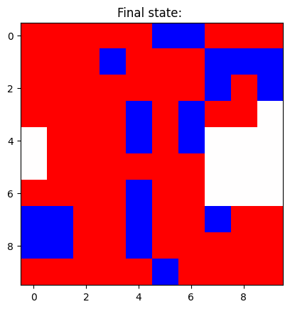
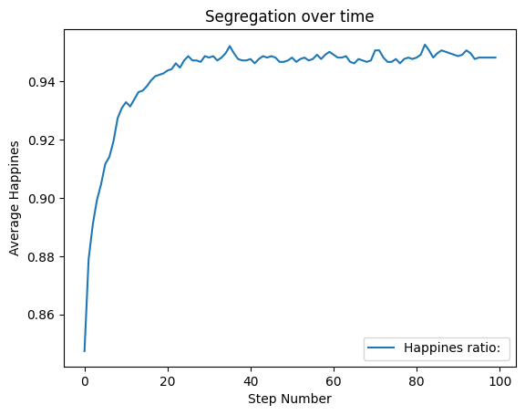
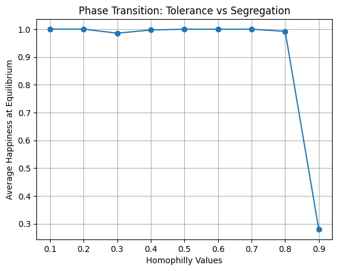
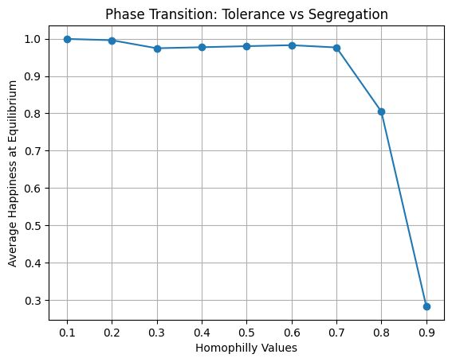

# Schelling Segregation Model Ananlysis

## Abstract:
Using mesa 3.0 to simulate a society in which *familys*(agents) act selfishly in order to maximize their *happiness*(homophily) I studied how segregation appears suddenly even in a tolerant society and how **resielient** said society appears to be to moderate increases in intolerance up to a tipping point where it breaks down and no family, regardless of group, can satisfy their happiness.

## Methodology:
The Schelling Model was implemented in Python using mesa 3.0 on a 50x50 torodial grid. For the *tolerant society*(homophily = 0.3) a reporter function took the happiness of each family at the end of each step and stored the average happiness. Later, in order to see how resilient this society was in the face of increasing intolerance, for each homophily value, ranging from 0.1 to 0.9, the model was run 10 times in order to ensure consistent results. Each run consisted of 100 steps, with a reporter function calculating the final happiness and then averaging out the results over the 10 batch runs. 

## Results:

Here in figures 1 and 2 when can see how even at a small scale and high tolerance level (low homophily), segrations appears.
Below in figure 1 the blue population and red population are mixed together. *Gated communities* (blocks or islands of one group) are not present and the mix is heterogenous 

Below is figure 2 presenting *Society* (the grid) after running the model for 50 steps. Here we can see how a *Gated community* has been formed along the left-hand side. Blue minority communities have also formed as is clearly observed on the bottom left-hand side.

Moving on to the larger 50x50 model used for data collection we can observe how segregation appears suddenly in the *tolerant* society. At step 20, as soon as a few *familys* form clusters they create *safe zones* for others triggering a cascade that leads to the formation of *gated communities*. At that point the system has found equilibrium, meaning almost every family found a place where they are comfortable. From the average happiness we can derive that society has become segregated as was observed above.

Finally, using the same model as for figure 3 but iterating over *tolerance levels* We can see how only when society becomes extremely intolerant (homophily = 0.9) does it breakdown. This graph clearly shows said phase transition from happiness to unhappiness. For this graph the *happiness score* was taken at the end of each run in each batch, meaning we do not see how society struglled to organize.

Below is the graph showing that although a highly intolerant society may be able to reach happiness in the end, the struggle to do so is more prolonged. This can be observed comparing the society of 0.8 homophily in the previous graph to this one. There we can see that at step 100 the society reached happiness, but with the information given by the graph below, we can see that average happiness during the 99 preceding steps was much lower. 

## Discusion
These findings suggest that society is more resistant to a colapse in societal cohesion than one would expect, with even extremely intolerant societys being able to resolve in a manner satisfactory to almost members, although with notably more effort.
It would be interesting to see how further complexity affected these findings(income levels, house pricing, geographic conditions, etc.)

